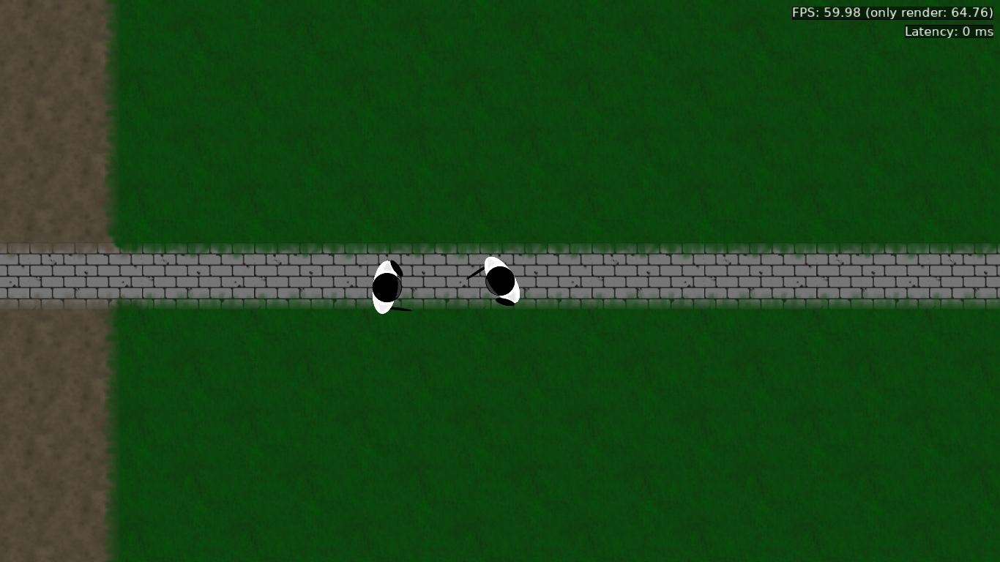

# MMORPG in Perl

This is a project to see how well would Perl + Castle Game Engine work together to deliver multiplayer experience. The concept has changed a couple of times, starting from turn-based in the browser and ending with real-time in a native client.



(see `gallery` directory for more screenshots)

I've been developing it on and off for a couple of years. Currently it offers working login, character selection and moving around world (just one location). Players can see each other when they enter their discovery radius. Some work in progress code exists for combat and chat. Game data is periodically saved to a database for each game process. No special measures in case of dying processes are implemented yet, so the whole system is quite volatile.

Perl spawns a couple of processes: one process for each game location, some processes for TCP and some processes for non-game tasks like logging in. IPC is done with Redis which works very fast. Mojolicious serves as TCP communication and event loop handler. Since it is Perl and each location is a single process, future performance remains a real concern.

## Prerequisites (Server)

- Perl 5.38 (preferably from perlbrew)
- Postgresql client library with headers
- Postgresql server
- Redis server
- GNU make

## Prerequisites (Client compilation)

- FPC 3.2.2
- latest Castle Game Engine

## Setup

Copy `.env.example` to `.env` and adjust the variables.

### Setup environment

Run this command to get required CPAN modules:

```
cpanm Carmel Sqitch Code::TidyAll Perl::Critic::Community Perl::Tidy App::Yath
```

### Setup dependencies

Run this:

```
carmel install && carmel rollout
```

### Setup tools

Not required, but can help:

```
mkdir -p .git/hooks
cp tools/git-hook-precommit .git/hooks/pre-commit
```

## Client setup

### Exporting data

Export lore: `script/cli export-lore en`

Export translations: `script/cli export-mo en`

Export maps: `script/cli export-maps`

### Compiling

Done with CGE build tool: `cd client && castle-engine compile`


## Running servers

`./run` will run both TCP server and workers, but not web server.

## Running website

`./run web-dev` to run development web server (auto restart on changes).

`./run web` to run production server (same server).

## Development tools

`./test` to run tests

`./run lint` to lint files

`./run critic` and `./run critic_tests` to see possible problems with code

## Code layout

### lib-base

Directory for base utilities that do not depend on the rest of the system.

### lib

#### CLI

Command line utilities' code.

#### Game

Actual game data structures and mechanics.

#### Server

Game backend related infrastructure. TCP servers, workers, game processes and message / event types.

#### Web

Website-related stuff. May be moved away to other repository in the future.

## Tips and Tricks

- better stack traces during debugging: `./run -MCarp::Always`

