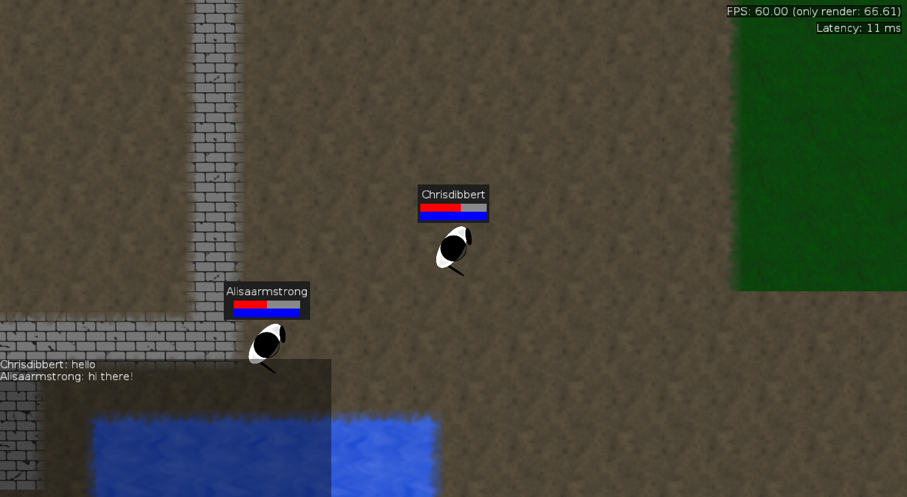

# Open Source MMORPG in Perl

This is a project created from love to multiplayer RPGs, purely to entertain
the thought of creating one myself.


(see `gallery` directory for more screenshots)

## Current state

The concept has changed a couple of times, starting from turn-based in the
browser and ending with real-time in a native client.

I've been developing it on and off for a couple of years. Currently it offers
working login, character selection and moving around world (just one location).
Players can see each other when they enter their discovery radius. The server
offers a working chat and some work-in-progress combat: players can hit each
other when pressing `A` key. They only hit others if they are in a small zone
in front of them and do constant damage.

## Lore

TBD, still working on technical aspects.

## Technical

Perl spawns a couple of processes: one process for each game location, some
processes for TCP and some processes for non-game tasks like logging in. IPC is
done with local Redis which offers low latency. IO::Async serves as TCP
communication and event loop handler. Since it is Perl and each location is a
single process, future performance remains a real concern.

Game data is periodically saved to a database for each game process. No special
measures in case of dying processes are implemented yet, so the whole system is
quite volatile.

## Running the server

```
docker compose build
docker compose run --rm game sh -c "carmel install && carmel rollout"
docker compose up -d
```

## Prerequisites (Client compilation)

- FPC 3.2.2
- latest Castle Game Engine

## Compiling

First, game data need to be prepared by running this command (inside docker):

`script/cli prepare_client en`

Compilation is done with `castle-editor` or CGE build tool: `cd client &&
castle-engine compile`

# Development info

## Development tools

Commands can be run inside "game" container after it is run.

`./test` to run tests

`./run lint` to lint files

`./run critic` and `./run critic_tests` to see possible problems with code

Not required, but can help by running linter automatically on commit (outside of docker):

```
mkdir -p .git/hooks
cp tools/git-hook-precommit .git/hooks/pre-commit
```

## Code layout

### lib-base

Directory for base utilities that do not depend on the rest of the system.

### lib

#### CLI

Command line utilities' code.

#### Game

Actual game data structures and mechanics.

#### Server

Game backend related infrastructure. TCP servers, workers, game processes and message / event types.

#### Web

Website-related stuff. May be moved away to other repository in the future.

## Tips and Tricks

- better debugging is enabled with `DEBUG=1` env, which can be added to `.env` file and read by docker compose

